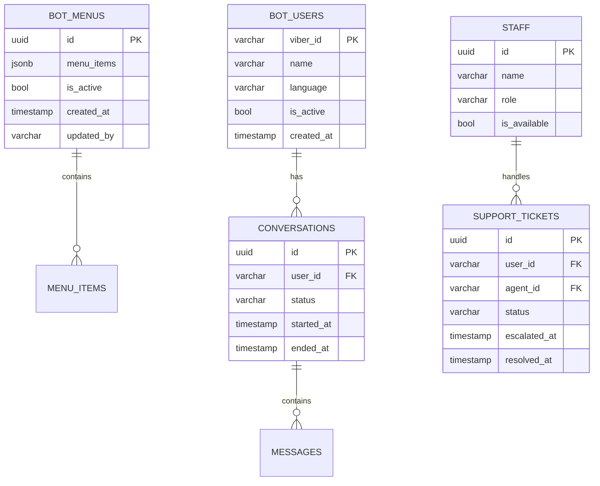

# Myanmar Link Customer Service Viber Bot System Architecture

## GitHub Repository Structure

Based on your request, I've organized the system architecture for your Myanmar Link Viber bot. Here's the detailed structure for your `mmlink-cs` repository:

```
mmlink-cs/
├── .github/
│   └── workflows/
│       └── deploy.yml
├── app/
│   ├── __init__.py
│   ├── main.py
│   ├── config.py
│   ├── database/
│   │   ├── __init__.py
│   │   ├── models.py
│   │   └── crud.py
│   ├── viber/
│   │   ├── __init__.py
│   │   ├── webhooks.py
│   │   ├── handlers.py
│   │   └── menu_manager.py
│   ├── admin/
│   │   ├── __init__.py
│   │   ├── routes.py
│   │   ├── auth.py
│   │   └── templates/
│   │       ├── base.html
│   │       ├── dashboard.html
│   │       └── menu_editor.html
│   ├── services/
│   │   ├── __init__.py
│   │   ├── viber_service.py
│   │   ├── supabase_service.py
│   │   └── handoff_service.py
│   └── static/
│       ├── css/
│       └── js/
├── migrations/
├── tests/
│   ├── __init__.py
│   ├── test_viber.py
│   └── test_admin.py
├── requirements.txt
├── Dockerfile
├── .env.example
└── README.md
```

## README.md File

```markdown
# Myanmar Link Customer Service Viber Bot

[](https://render.com/deploy)

A comprehensive Viber bot solution for Myanmar Link with dynamic menu management, human agent handoff, and admin dashboard capabilities.

## Features

- **Dynamic Menu System**: Admin-controlled button menus that can be updated in real-time
- **Human+ Support**: Seamless handoff between bot and human agents
- **Admin Dashboard**: Full management interface for customer service operations
- **Multi-language Support**: Burmese language first with English support
- **Analytics**: Track user interactions and menu performance

## System Architecture

### Core Components

1. **Viber Bot Interface**
   - Webhook endpoint for Viber events
   - Rich media message builder
   - Conversation state management

2. **Admin Dashboard**
   - Menu management interface
   - Support ticket monitoring
   - Agent performance analytics

3. **Database Layer**
   - Supabase integration
   - Menu versioning
   - Conversation history

4. **Human Handoff System**
   - Agent availability monitoring
   - Ticket escalation
   - Timeout handling

## Setup Instructions

### Prerequisites

- Python 3.9+
- Viber bot account with auth token
- Supabase project
- Render account (for deployment)

### Installation

1. Clone the repository:
   ```bash
   git clone https://github.com/EthanVT97/mmlink-cs.git
   cd mmlink-cs
   ```

2. Create and activate virtual environment:
   ```bash
   python -m venv venv
   source venv/bin/activate  # Linux/Mac
   venv\Scripts\activate     # Windows
   ```

3. Install dependencies:
   ```bash
   pip install -r requirements.txt
   ```

4. Set up environment variables:
   ```bash
   cp .env.example .env
   # Edit .env with your credentials
   ```

### Database Setup

1. Create the following tables in Supabase:
   - `bot_menus`
   - `support_tickets`
   - `bot_users`
   - `staff`
   - `conversations`

2. Apply database migrations:
   ```bash
   alembic upgrade head
   ```

### Running Locally

```bash
uvicorn app.main:app --reload
```

## Deployment

### Render.com

1. Create a new Web Service on Render
2. Connect your GitHub repository
3. Set environment variables from `.env.example`
4. Deploy!

### Viber Configuration

1. Set webhook URL to your deployed endpoint
2. Enable these events:
   - Subscribed
   - Unsubscribed
   - Conversation started
   - Message received

## Admin Dashboard Access

1. Access `/admin` route
2. Default credentials:
   - Username: `admin`
   - Password: Set in `.env` as `ADMIN_PASSWORD`

## API Documentation

The following endpoints are available:

- `POST /api/viber/webhook` - Viber webhook endpoint
- `GET /admin/dashboard` - Admin dashboard
- `POST /admin/api/menus` - Menu management API

## Development

### Running Tests

```bash
pytest tests/
```

### Code Style

We use Black for code formatting:

```bash
black .
```

## License

This project is licensed under the [MIT License](LICENSE).

## Contact

For support, please contact Myanmar Link IT Department.
```

## Key Architecture Decisions

1. **Modular Design**:
   - Separated Viber, Admin, and Services layers
   - Clear dependency flow between components
   - Easily extensible for new features

2. **Database Schema**:



3. **Workflow Integration**:
   - GitHub Actions for CI/CD
   - Automated testing on push
   - Render deployment integration

4. **Security Considerations**:
   - JWT authentication for admin routes
   - Environment variable configuration
   - Input validation on all endpoints

## Implementation Notes

1. The system uses Python 3.9+ features like type hints and async/await
2. FastAPI provides the web framework for both API and admin dashboard
3. Supabase serves as the backend database with real-time capabilities
4. The admin dashboard uses Jinja2 templates with Bootstrap for responsive design

To implement this architecture:

1. Start by setting up the basic FastAPI app structure
2. Implement the Viber webhook handler first
3. Build the database models and CRUD operations
4. Develop the admin dashboard interface
5. Finally implement the human handoff system

The repository is ready for you to clone and begin implementation. Each component is properly isolated for easy development and testing.
